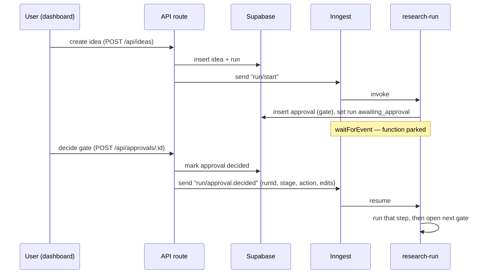

# Architecture

## What it is
SignalOS turns a **product idea** into a **market-signal report** through a sequence
of **human-driven steps**. The defining property: it is a *manual step-runner*, not
an autonomous agent. Nothing executes ahead of the operator — each step is a gate
that shows what is about to run, lets you edit it, and waits for a click.

The pipeline of steps:

```
Idea → Discovery → Fetch → Sample(×N) → Analyze → Report
```

- **Discovery** (LLM) — propose where to listen (subreddits, accounts, hashtags, search terms).
- **Fetch** (scrapers) — pull recent posts + engagement for the sources you approve.
- **Sample** (scrapers, repeatable) — re-capture engagement to measure velocity.
- **Analyze** (LLM) — synthesize themes, pain points, demand signals.
- **Report** (LLM) — write a decision-ready report with a go/explore/pass scorecard.

## Tech stack & responsibilities

```mermaid
flowchart LR
  subgraph Browser
    UI[Next.js dashboard<br/>App Router, client+server components]
  end
  subgraph Vercel/Node
    API[API routes<br/>/api/ideas, /api/approvals, /api/inngest]
    WF[Inngest function<br/>research-run.ts]
    LIB[Libraries<br/>llm, sources, agent, cost, plan]
  end
  ING[Inngest engine<br/>durable steps + waitForEvent]
  DB[(Supabase Postgres)]
  AN[Anthropic API]
  AP[Apify actors]
  RS[Resend email]

  UI -->|fetch| API
  API -->|insert/read| DB
  API -->|send event| ING
  ING -->|invoke per step| WF
  WF --> LIB
  LIB -->|complete()| AN
  LIB -->|runActor()| AP
  WF -->|read/write| DB
  WF -->|notify| RS
  UI -->|poll / soft-refresh| API
```

| Concern | Tech | Where |
|---|---|---|
| Dashboard + API | Next.js (App Router) | `src/app/**` |
| Durable orchestration | Inngest | `src/inngest/**` |
| Database / persistence | Supabase Postgres | `supabase/migrations/**`, `src/lib/supabase/server.ts` |
| LLM reasoning | Anthropic | `src/lib/llm/client.ts`, `src/lib/agent/**` |
| Scraping (Reddit/X/IG) | Apify | `src/lib/sources/**` |
| Email notifications | Resend | `src/lib/email.ts` |

## Why Inngest (the key architectural choice)
A run can sit at a gate for minutes or hours waiting on the human. A normal request
can't hold that long, and we want **durability** (survive restarts/deploys),
**memoized steps** (never re-run a completed step), and **per-step serverless
duration** (each scrape gets its own short-lived invocation). Inngest provides all
three. Each step is one `step.run(...)`; each gate is a `step.waitForEvent(...)`
that parks the function until the dashboard emits a matching event. See
[WORKFLOW.md](WORKFLOW.md).

## Request/resume cycle (the heartbeat)



## Directory map (where to look)

```
src/
  app/
    page.tsx                  Home: new-idea form + runs list
    runs/[id]/page.tsx        The run console (gate card, live tail, sections)
    logs/page.tsx             Global LLM-call log
    costs/page.tsx            Global cost breakdown
    api/
      ideas/route.ts          Create idea+run, fire "run/start"
      approvals/[id]/route.ts Decide a gate, fire "run/approval.decided"
      inngest/route.ts        Inngest serve endpoint (maxDuration set here)
      runs/[id]/activity/...  Incremental feed for the live tail
  inngest/
    client.ts                 Inngest client + event names
    functions/research-run.ts THE workflow — the manual step state machine
  lib/
    supabase/server.ts        Service-role client (no-store fetch)
    llm/client.ts             The ONLY path to the model; logs every call
    agent/                    Prompt build/parse per stage (discovery/analysis/report) + runPrompt
    sources/                  Source-adapter interface + Reddit/X/IG adapters + registry
    cost.ts                   Cost ledger + execution-scoped attribution context
    metrics.ts                Engagement-velocity math
    plan.ts                   "Next step" preview (tools, runtime, cost estimates)
    activity.ts, email.ts, types.ts
  components/
    ApprovalPanel.tsx         The universal "next step" gate card (prompt / fetch / sample modes)
    LiveTail.tsx              Terminal-style polling activity stream
    AutoRefresh.tsx           Soft-refresh while the agent is working
    NextStepPlan.tsx, Section.tsx, Markdown.tsx, StatusBadge.tsx
supabase/migrations/          Schema (0001 core, 0002 costs, 0003 RLS)
docs/                         These docs
scripts/check-db.mjs          Standalone DB reachability check
```

## Core principles to preserve
1. **Every step is a gate.** Discovery, fetch, each sample, analysis, report. The
   operator reviews and runs each one. (An "auto-run" mode is a future toggle.)
2. **One logged path to the model.** All LLM calls go through `llm/client.ts`, which
   persists full input/output/tokens/cost. Never call Anthropic directly elsewhere.
3. **Sources are pluggable adapters** behind one interface. Scrapers return
   snapshots; *we* re-sample and compute velocity.
4. **The model is told what will run, with the ability to edit it.** Prompts and
   scraper configs are surfaced and editable before execution.
5. **Everything is observable** — LLM calls, costs, and a human-readable activity
   feed, all per-run and inline in the dashboard.
