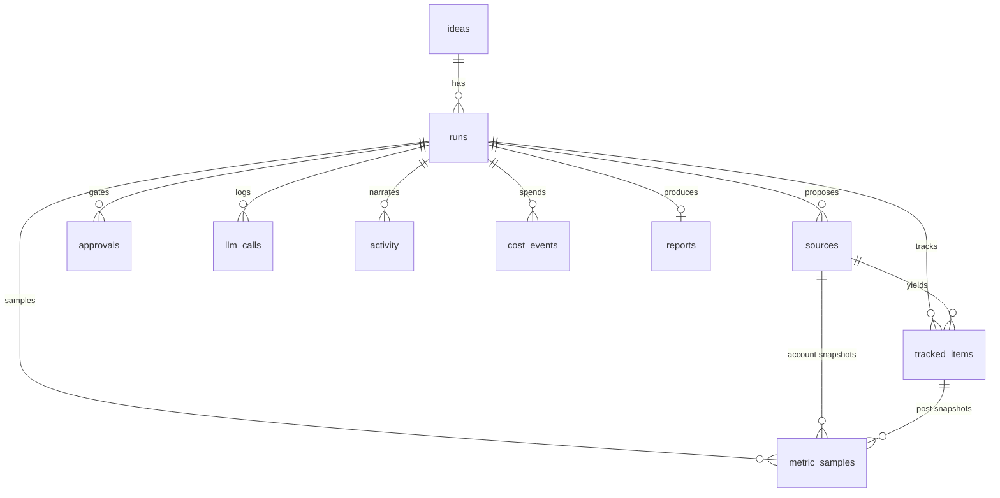

# Data Model

Postgres on Supabase. Schema lives in `supabase/migrations/`:
- `0001_init.sql` — core tables
- `0002_costs.sql` — the cost ledger
- `0003` (applied via the Supabase MCP) — **RLS enabled** on all tables

All access is **server-side via the service-role key** (`src/lib/supabase/server.ts`),
which bypasses RLS. The browser never talks to Supabase directly.

## Entity relationships

## Tables

| Table | Purpose | Key columns |
|---|---|---|
| **ideas** | A product idea (the prompt you feed in) | `prompt`, `title`, `status` |
| **runs** | One research run = one workflow instance | `idea_id`, `status`, `stage`, `config` (jsonb), `error` |
| **sources** | Where to listen, proposed by discovery then approved | `run_id`, `platform`, `kind`, `handle`, `rationale`, `status` (proposed/approved/rejected) |
| **tracked_items** | Individual posts/threads/tweets being tracked | `run_id`, `source_id`, `platform`, `external_id` (dedupe), `url`, `body`, `posted_at` |
| **metric_samples** | **Time series** of engagement; one row per snapshot | `tracked_item_id` or `source_id`, `scope` (post/account), `captured_at`, `likes/comments/shares/views/score/followers`, `metrics` (jsonb) |
| **approvals** | The human-in-the-loop gates | `run_id`, `stage`, `payload` (jsonb: prompt or settings), `status`, `decision` (jsonb) |
| **llm_calls** | **Full** record of every model call | `run_id`, `stage`, `purpose`, `model`, `system_prompt`, `input`, `output_text`, `output_raw`, `input/output_tokens`, `cost_usd`, `latency_ms`, `status` |
| **activity** | Human-readable step-by-step audit (drives the live tail) | `run_id`, `type`, `message`, `data`, `created_at` |
| **cost_events** | Unified spend ledger across providers | `run_id`, `idea_id`, `provider`, `category`, `amount_usd`, `units`, `metadata` |
| **reports** | The deliverable | `run_id`, `idea_id`, `summary`, `body_md`, `scorecard` (jsonb) |

## Conventions
- **`runs.config`** (jsonb): `{ platforms: string[] }` (plus reserved fields for a
  future auto-run mode). The window/sample knobs are gone — sampling is manual.
- **`runs.stage`** mirrors the workflow stage; `runs.status` is the lifecycle state.
  See [WORKFLOW.md](WORKFLOW.md) for valid values.
- **`metric_samples` is the heart of "velocity."** Scrapers give point-in-time
  numbers; storing repeated snapshots lets `src/lib/metrics.ts` compute change/hour.
- **`approvals.payload`** carries what's editable at the gate (the prompt object for
  prompt gates; proposed-source count + scrape defaults for the fetch gate).
- **`approvals.decision`** records the operator's action and edits.

## Security posture (RLS)
RLS is **enabled** on every table with **no policies**, which denies the `anon` and
`authenticated` roles entirely. The service-role key (server-only) bypasses RLS, so
the app works while the public anon key returns nothing. Before exposing a
multi-user product, add real policies. See [DECISIONS.md](DECISIONS.md).

## A note on cascades
Deleting an `idea` cascades to its `runs` and everything under them (`sources`,
`tracked_items`, `metric_samples`, `approvals`, `llm_calls`, `activity`, `reports`).
`cost_events.run_id`/`idea_id` are `ON DELETE SET NULL`, so prune orphaned cost rows
(`run_id is null`) if you bulk-delete.
