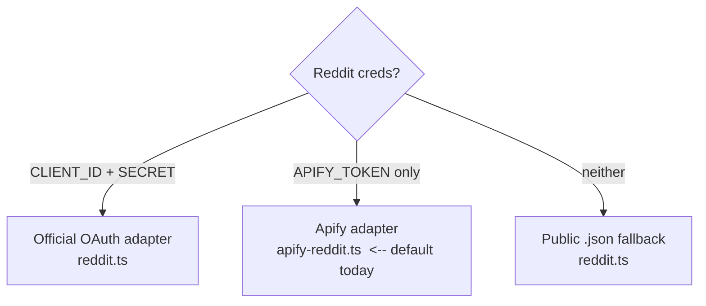

# Sources & Scraping

Every signal platform is a **pluggable adapter** behind one interface. The workflow
never knows platform specifics; it asks the registry for an adapter and calls the
interface. Files: `src/lib/sources/`.

## The adapter interface
`src/lib/sources/types.ts` defines `SourceAdapter` with three methods:

| Method | Purpose |
|---|---|
| `resolveHandle(source)` | Validate a handle and return its account-level snapshot (followers, etc.), or null. |
| `fetchItems(source, opts)` | Pull current items for an approved source. `opts = { limit, sort?, time? }`. Returns normalized items each with an initial metric snapshot. |
| `sampleItems(items)` | Re-fetch engagement for already-tracked items (for velocity). Keyed by `external_id`. |

Items and metrics are **normalized** into a common shape (`FetchedItem`,
`SampleMetrics`) so analysis/report code is platform-agnostic. Each adapter keeps the
raw payload in a `raw` field for safety.

## The registry & Reddit's mode selection
`src/lib/sources/index.ts` maps `platform → adapter` via `adapterFor()`. Reddit is
special: `pickReddit()` chooses an implementation by which credentials exist —

This means: switching Reddit to the official API later is a **credentials change, no
code change**. (Today the official Reddit data API is effectively closed — see
[DECISIONS.md](DECISIONS.md) — so Apify is the default.)

## Current adapters
| Platform | File | Backend | Notes |
|---|---|---|---|
| reddit | `apify-reddit.ts` (default), `reddit.ts` (oauth/public) | Apify `harshmaur/reddit-scraper` | Returns upvotes/comments + pre-computed velocity. |
| x | `apify-x.ts` | Apify `xquik/x-tweet-scraper` | Runs on the Apify **free** tier (the apidojo actor does not). |
| instagram | `apify-instagram.ts` | Apify `apify/instagram-scraper` | Account posts + hashtag pages. |

Apify plumbing (run an actor, capture cost, log activity) is shared in
`src/lib/sources/apify.ts`. Actor IDs are overridable via env
(`REDDIT_APIFY_ACTOR`, `APIFY_X_ACTOR`, `APIFY_INSTAGRAM_ACTOR`).

## The snapshot model (why we re-sample)
Scrapers (and Google Trends, etc.) return **point-in-time** numbers, not a time
series. So:
1. **Fetch** captures snapshot #1 of each item's engagement.
2. **Sample** captures additional snapshots over time.
3. `src/lib/metrics.ts` computes **velocity** (change per hour) and first/last values
   from the stored snapshots.

High engagement *velocity* on a pain point is the strongest demand signal — much more
than a raw like count.

## Cost & observability hooks
Every actor run goes through `runActor()` in `apify.ts`, which: records a
`cost_events` row (re-fetching the Apify run to read `usageTotalUsd`), and writes an
activity line for the live tail. Attribution to the run/idea relies on the
execution-scoped context set in the workflow — see [OBSERVABILITY.md](OBSERVABILITY.md).

## Adding a platform — see [EXTENDING.md](EXTENDING.md).
