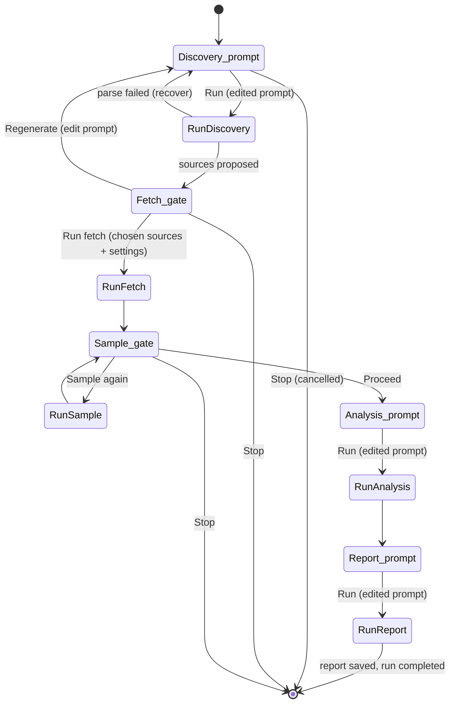

# The Workflow (manual step-runner)

The entire run is one durable Inngest function: `src/inngest/functions/research-run.ts`.
It is a state machine where **every transition between steps is a gate** that pauses
the function until the operator acts in the dashboard.

## Step sequence

Stages (the `runs.stage` / gate `stage` values): `discovery_prompt`, `discovery`(→stage `fetch`),
`fetch`, `sample`, `analysis_prompt`, `report_prompt`. Run statuses: `pending`,
`running`, `awaiting_approval`, `completed`, `failed`, `cancelled`.

## How a gate works (the resume mechanism)
A "gate" is three things acting together:
1. A row in **`approvals`** with `status='pending'` and a `stage`, plus a `payload`
   carrying what's editable (the prompt object, or the proposed-sources count +
   scrape defaults).
2. The run's `status` set to `awaiting_approval`.
3. A `step.waitForEvent(...)` in the function, matched by an `if` expression on
   `runId` **and** `stage`.

The dashboard renders the pending approval as a "next step" card (see
`src/components/ApprovalPanel.tsx`). When the operator clicks a button,
`POST /api/approvals/[id]` marks the approval decided and emits
`run/approval.decided` with `{ runId, stage, action, editedPrompt?, approvedSourceIds?, scrapeSettings? }`.
Inngest matches the waiting step and resumes; the function reads the event payload
and runs that step.

> **Determinism rule:** Inngest replays the function body on every step. All
> `step.run`/`step.waitForEvent` IDs must be deterministic. Loops use an attempt/round
> counter in the ID (e.g. `run-discovery-${attempt}`, `sample-gate-${round}`).

## The two loops
- **Discovery ↔ Fetch (regenerate):** `while (!fetchConfigured)`. Open the discovery
  prompt gate → run discovery → open the fetch gate. At the fetch gate the operator
  can **Run** (proceed), **Regenerate** (edit the prompt and re-run discovery, looping
  with `attempt++`), or **Stop**.
- **Sample (repeatable):** `while (!samplingDone)`. The first engagement snapshot is
  captured during Fetch. Each "Sample again" runs another snapshot and re-opens the
  gate; "Proceed" exits to Analysis. Velocity needs ≥2 snapshots.

## Per-step LLM editing (build / gate / run)
LLM steps are split so the prompt can be reviewed before it executes:
1. **build** — assemble an editable prompt object `{ system, lockedSuffix, user }`
   (`src/lib/agent/*.ts`). `lockedSuffix` is the output-format/JSON-shape instruction;
   it is shown read-only so edits can't break parsing.
2. **gate** — store the prompt in the approval payload; the panel renders editable
   system + user fields.
3. **run** — `runPrompt()` (`src/lib/agent/prompt.ts`) merges edits, appends the
   locked suffix, calls the logged client, and the stage-specific `parseXxx()` reads
   the result.

## Fetch execution detail
After the fetch gate, approved sources are scraped **one source per `step.run`**
(`fetch-${sourceId}`) so no single serverless invocation runs too long. Scrape
parameters (`limit`, `sort`, `time`) chosen at the gate flow into each adapter's
`fetchItems`. See [SOURCES.md](SOURCES.md).

## Recovery & failure
- **Discovery parse failure** (e.g. truncated output) does **not** crash or burn
  retries — the step catches it, logs a clear message, and the loop re-opens the
  discovery prompt gate so the operator can adjust and retry.
- **Gate timeouts** (14 days) mark the run `failed`.
- **Stop** at any gate marks the run `cancelled`.
- Token caps for LLM steps are intentionally generous (truncation → parse failure);
  see [DECISIONS.md](DECISIONS.md).

## Cost attribution inside steps
Apify cost attribution uses an execution-scoped context (`src/lib/cost.ts`). Critical
subtlety: this context must be established **inside** each scraping step (via a
`withCost(...)` wrapper), because the context does not survive Inngest's step
boundary. See [OBSERVABILITY.md](OBSERVABILITY.md) and [DECISIONS.md](DECISIONS.md).

## Live updates (no manual refresh)
While the function is working toward the next gate, the run page soft-refreshes via
`src/components/AutoRefresh.tsx` (it pauses while a gate is waiting on the user,
since nothing changes server-side until they act). The activity tail
(`LiveTail.tsx`) polls `/api/runs/[id]/activity` independently.
